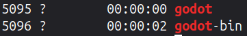

> [!IMPORTANT]
> If anthing remains unclear during this tutorial, please open a new GitHub issue through this link -> https://github.com/VoxelChicken/TimeTracker/issues

# Requirements

- A terminal / shell that supports bash and its scripts.
- (As of the first release, a **FLATPAK SOFTWARE** to track its time. This will likely be changed in the future.)
- Python is installed on your computer.

# Download

There's two ways you can download this project.

## Through the Terminal (Command Line)

> [!NOTE]  
> Since you need to open the terminal (which some might have not even touched yet, and I get that they are scared of it at first), this way is recommended for the people who know what they are doing.

> **Step 1:**  
> Open the terminal and go to the desired folder (in which you want the cloned repo to be located in).

> [!NOTE]  
> For the first step, I would strongly recommend you make a folder that has the program you want to track as its name, so e.g. "Godot-Time-Tracker".


> **Step 2:**  
> Copy paste this command:  
> ```bash
> gh repo clone VoxelChicken/TimeTracker  
> ```
> This will clone the entire GitHub repository.

## Through the GitHub Website UI

This is the nicer way of doing it. You don't have to touch the terminal.

Since you most likely already have GitHub with this repo opened, you can press the *green button* "Code" next to the "about" section of the GitHub repo main page.  
If you don't have GitHub opened, use this link:  
https://github.com/VoxelChicken/TimeTracker

---

Now that you have the download complete, let's move on to the setup and explanation of the program:

# Files

The files / folders in this repo include:

"img" - the screenshots  
"code" - the python and shell code  
".gitignore" - this is needed for the .venv and .idea (and other) files to not get pushed to the GitHub repo.  
"README.md" - (the thing you're reading currently)

> "code" contents:  
>> "TimeTracker.py" - the mini "library" (or simple class) that makes the project's code a bit easier to read. This "library" will then get imported into "main.py".
>> 
>> "main.py" - the main program of them all, it basically coordinates all the files neatly.
>> 
>> "seconds-data" - Holds the amount of seconds you've spent in the targeted program.
>> 
>> "program_to_check" - containing a simple line for the bash script ("run_program.sh") to know which program to look for (if it's running). As an example, if you would want to check for Godot, it should say "godot-bin". (Explanation found below.)
>> 
>> "run_program.sh" - the shell script that checks roughly every second to see if the program is still running. It exits if it can't be found any longer. (The "main.py" automatically notices the shell script's end and continues with the "atexit.register()" function.

> "img" contents:  
>> The images and screenshots. There's really not much to say about this.


# Setup

## Figuring out the exact process' name

So, this will be a bit more complicated - but don't be scared, you just have to follow these steps.

You will now want to check what program's EXACT name to check for. It might be a bit unexpected, like if you want to check for Godot, you should actually look for the running process called "godot-bin".

To do this, follow these steps:

> **Step 1:**  
> Open the terminal and the program you want to run NORMALLY (like you would any other, normal day).

> **Step 2:**  
> Now, think of the program name anybody normally calls it, like "godot", "pycharm", or anything else, it just has to be something that could maybe be it.

> **Step 3:**  
> Copy paste this command (where [PROGRAM_NAME] is your guessed program name you came up with to look for in *step 2*):  
> ```bash
> ps -e | grep [PROGRAM_NAME]
> ```

> [!IMPORTANT]
> If you don't see any program that shows up, then run the command again but with a **different program name**. Keep doing this until you get a program name.  
> If you can't find any program at all, open up a new GitHub issue under:  
> https://github.com/VoxelChicken/TimeTracker/issues

Then, the program should show up. This is an example of me trying to look up "godot".



> [!IMPORTANT]
> Here, only "godot-bin" and "godot" show up. It is important you differentiate the two, as in when they are running.  
> In this case, you can open up the Godot Editor when opening a project, and then running the same command **"ps -e | grep [PROGRAM_NAME]"** (the program name you have hopefully already figured out).
> 
> In this case, the process "godot" AND "godot-bin" both run when the Godot Project Manager is currently open.  
> As soon as you open the Godot Editor, you will see that only "godot-bin" is visible if you run the same terminal command **"ps -e | grep [PROGRAM_NAME]"**.  

## Changing the Code to your Desire

Now that you have found out the process' name, you have to modify the code accordingly.

> **Step 1:**  
> Open the "main.py" file in your desired text editor.

> **Step 2:**  
> Change the (as of now) the **4. line**  
> from this:  
> ```python
> tc = TimeTracker.TimeTracker(program_to_check="godot-bin", program_to_run="org.godotengine.Godot")
> ```
> to this:  
> ```python
> tc = TimeTracker.TimeTracker(program_to_check="[PROGRAM_NAME]", program_to_run="[FLATHUB_WEBSITE_NAME]")"
> ```
> (where the *PROGRAM_NAME* is the program's name you have found out using the terminal, and *FLATHUB_WEBSITE_NAME* is the way you downloaded the program via Flatpak, so for Godot, it's "org.godotengine.Godot".).

> [!NOTE]
> If you're unsure about the name of the website that you downloaded it from, you can run this in your terminal:  
> ```bash
> flatpak search [PROGRAM_NAME]
> ```
> This will search for the program on *Flathub*.

Now that that's done, navigate to the *code* folder using the terminal and run the python program using this terminal command:  
```bash
python main.py
```

This will run the *main.py* script, which launches the program and tracks its usage time.

# Issues?

As I said many times by now - if you have any issues during this process, please open a new issue under https://github.com/VoxelChicken/TimeTracker/issues. It is really important to me and I would like to make everyone's experience better :D

---

Now, have fun!
